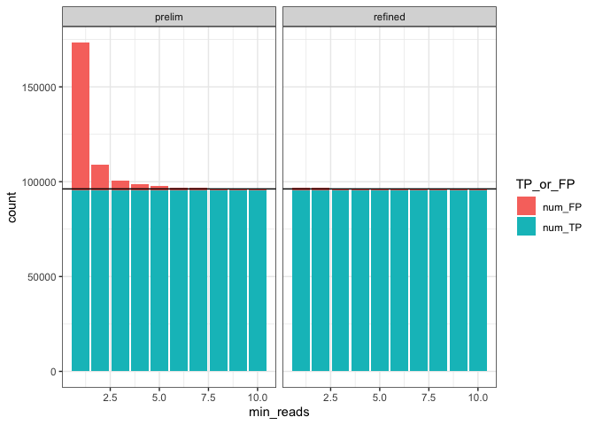

compare prelim to refined insertions
================
Brian Haas
11/13/2021

``` r
# parse benchmarking results for the preliminary and final (refined) insertion site predictions

prelim_TP_FP = read.table("prelim_insertion_mappings.tsv.called_preds", sep="\t", header=T, stringsAsFactors = F)
prelim_TP_FP$type='prelim'

refined_TP_FP = read.table("refined_insertion_mappings.tsv.called_preds", sep="\t", header=T, stringsAsFactors = F)
refined_TP_FP$type='refined'

TP_FP_data = bind_rows(prelim_TP_FP, refined_TP_FP)
```

``` r
# Examine TP and FP counts vs. min read evidence threshold

TP_FP_data = TP_FP_data %>% gather(key='TP_or_FP', value='count', num_TP, num_FP)

TP_FP_data %>% head()
```

    ##   min_reads   type TP_or_FP count
    ## 1         1 prelim   num_TP 95473
    ## 2         2 prelim   num_TP 95449
    ## 3         3 prelim   num_TP 95431
    ## 4         4 prelim   num_TP 95414
    ## 5         5 prelim   num_TP 95383
    ## 6         6 prelim   num_TP 95366

``` r
# plot counts of TP and FP according to min read support required.

NUM_TRUTH_ENTRIES = nrow(read.table(gzfile("data/insertion_truth_set.tsv.gz"), header=T))

TP_FP_data %>% ggplot(aes(x=min_reads, y=count, fill=TP_or_FP)) + geom_col() + facet_wrap(~type) + 
    geom_abline(intercept=NUM_TRUTH_ENTRIES, slope=0, color='black') +
    theme_bw()
```

<!-- -->

# Examine sensitivity per virus

``` r
prelim_insertions_per_virus = read.table("prelim_insertion_mappings.tsv.TP_called_per_virus", sep="\t", header=T, stringsAsFactors = F)

prelim_insertions_per_virus %>% group_by(min_reads, sum_found) %>% tally() %>%
    ggplot(aes(x=sum_found, y=n, color=min_reads, group=min_reads)) + geom_line() +
  ylab("number of distinct viruses") +
  ggtitle("virus count ~ num of 100 sim insertions found vs. minimum read support required") +
    theme_bw()
```

<!-- -->

``` r
# Examine sensitivity for HPV strains

prelim_insertions_per_virus %>% filter(grepl("HPV", vir_chr)) %>% ggplot(aes(y=sum_found, x=min_reads, group=vir_chr, color=vir_chr)) + 
    theme_bw() +
    theme(legend.position = "none") + geom_jitter(width=0.1, height=0.1) +  
    ggtitle("143 HPV isolates insertion sensitivity ~ min evidence reads") 
```

<!-- -->

Are there viruses that appear to be recalcitrant to our approach?

``` r
prelim_insertions_per_virus %>% filter(min_reads==5)  %>% arrange(sum_found) %>% 
    ggplot(aes(x=reorder(vir_chr, sum_found), y=sum_found)) + geom_point()  + theme_bw()
```

<!-- -->

``` r
prelim_insertions_per_virus %>% filter(min_reads==5) %>% arrange(sum_found) %>% head(n=20)
```

    ##    min_reads                                                   vir_chr
    ## 1          5             NC_001355_7902nt_Human_papillomavirus_type_6b
    ## 2          5             NC_034616_7812nt_Human_papillomavirus_type_85
    ## 3          5               NC_007605_171823nt_Human_gammaherpesvirus_4
    ## 4          5                NC_006151_143461nt_Suid_alphaherpesvirus_1
    ## 5          5               NC_001806_152222nt_Human_alphaherpesvirus_1
    ## 6          5            NC_004812_156789nt_Macacine_alphaherpesvirus_1
    ## 7          5             NC_009334_172764nt_Human_herpesvirus_4_type_2
    ## 8          5               NC_001798_154675nt_Human_alphaherpesvirus_2
    ## 9          5             NC_007653_156487nt_Papiine_alphaherpesvirus_2
    ## 10         5                      NC_001364_13246nt_Simian_foamy_virus
    ## 11         5                NC_001716_153080nt_Human_betaherpesvirus_7
    ## 12         5                       NC_004105_209771nt_Ectromelia_virus
    ## 13         5                     NC_013804_145289nt_Pseudocowpox_virus
    ## 14         5                           NC_003663_224499nt_Cowpox_virus
    ## 15         5 NC_010820_13111nt_African_green_monkey_simian_foamy_virus
    ## 16         5               NC_043445_13072nt_Guenon_simian_foamy_virus
    ## 17         5               NC_001348_124884nt_Human_alphaherpesvirus_3
    ## 18         5                         NC_003391_205719nt_Camelpox_virus
    ## 19         5               NC_001664_159378nt_Human_betaherpesvirus_6A
    ## 20         5    NC_039024_13220nt_Central_cimpanzee_simian_foamy_virus
    ##    sum_found
    ## 1          6
    ## 2         37
    ## 3         63
    ## 4         85
    ## 5         88
    ## 6         88
    ## 7         88
    ## 8         89
    ## 9         91
    ## 10        92
    ## 11        92
    ## 12        92
    ## 13        92
    ## 14        93
    ## 15        93
    ## 16        93
    ## 17        94
    ## 18        94
    ## 19        95
    ## 20        95

# precision/recall plots

``` r
get_TP_FP_per_virus = function(file_prefix) {
    
    TP_per_virus_fname = paste0(file_prefix, ".TP_called_per_virus")
    FP_per_virus_fname = paste0(file_prefix, ".FP_per_virus")
    
    TP_per_virus = read.table(TP_per_virus_fname, header=T, sep="\t", stringsAsFactors = F) %>% rename(TP = sum_found)
    FP_per_virus = read.table(FP_per_virus_fname, header=T, sep="\t", stringsAsFactors = F) %>% rename(FP = n)
    
    TP_FP_per_virus = full_join(TP_per_virus, FP_per_virus, by=c('min_reads', 'vir_chr'))
}


prelim_TP_FP_data = get_TP_FP_per_virus("prelim_insertion_mappings.tsv") %>% mutate(type='prelim')
refined_TP_FP_data = get_TP_FP_per_virus("refined_insertion_mappings.tsv") %>% mutate(type='refined')

# merge prelim and refined
accuracy_data = bind_rows(prelim_TP_FP_data, refined_TP_FP_data)

accuracy_stats = accuracy_data %>% group_by(min_reads, type) %>% 
    summarize(sum_FP = sum(FP, na.rm = T), sum_TP = sum(TP, na.rm=T))  %>% 
    mutate(recall=sum_TP/NUM_TRUTH_ENTRIES, precision = sum_TP/(sum_TP + sum_FP)) %>%
    mutate(F1= (2*precision*recall)/(precision+recall) ) 
```

    ## `summarise()` has grouped output by 'min_reads'. You can override using the
    ## `.groups` argument.

``` r
accuracy_stats %>% 
    ggplot(aes(x = recall, y = precision, color=type)) +
    geom_point() + geom_line(aes(groups=type)) +
  ggtitle("precision ~ recall") + theme_bw()
```

    ## Warning in geom_line(aes(groups = type)): Ignoring unknown aesthetics: groups

<!-- -->

``` r
accuracy_stats %>% 
    ggplot(aes(x = min_reads, y = F1, color=type)) +
    geom_point() + geom_line(aes(groups=type)) +
  ggtitle("F1 ~ min_reads") + theme_bw()
```

    ## Warning in geom_line(aes(groups = type)): Ignoring unknown aesthetics: groups

<!-- -->

``` r
accuracy_stats %>% filter(type== "prelim")
```

    ## # A tibble: 10 × 7
    ## # Groups:   min_reads [10]
    ##    min_reads type   sum_FP sum_TP recall precision    F1
    ##        <int> <chr>   <int>  <int>  <dbl>     <dbl> <dbl>
    ##  1         1 prelim  77711  95473  0.992     0.551 0.709
    ##  2         2 prelim  13374  95449  0.992     0.877 0.931
    ##  3         3 prelim   4925  95431  0.992     0.951 0.971
    ##  4         4 prelim   3134  95414  0.992     0.968 0.980
    ##  5         5 prelim   2324  95383  0.992     0.976 0.984
    ##  6         6 prelim   1692  95366  0.991     0.983 0.987
    ##  7         7 prelim   1284  95336  0.991     0.987 0.989
    ##  8         8 prelim   1035  95301  0.991     0.989 0.990
    ##  9         9 prelim    857  95262  0.990     0.991 0.991
    ## 10        10 prelim    718  95214  0.990     0.993 0.991

``` r
accuracy_stats %>% filter(type== "refined")
```

    ## # A tibble: 10 × 7
    ## # Groups:   min_reads [10]
    ##    min_reads type    sum_FP sum_TP recall precision    F1
    ##        <int> <chr>    <int>  <int>  <dbl>     <dbl> <dbl>
    ##  1         1 refined   1486  95319  0.991     0.985 0.988
    ##  2         2 refined   1377  95309  0.991     0.986 0.988
    ##  3         3 refined   1262  95306  0.991     0.987 0.989
    ##  4         4 refined   1183  95303  0.991     0.988 0.989
    ##  5         5 refined   1107  95299  0.991     0.989 0.990
    ##  6         6 refined   1029  95296  0.991     0.989 0.990
    ##  7         7 refined    973  95296  0.991     0.990 0.990
    ##  8         8 refined    927  95291  0.991     0.990 0.990
    ##  9         9 refined    889  95289  0.991     0.991 0.991
    ## 10        10 refined    860  95283  0.990     0.991 0.991
