examine_bmark_accuracy
================
bhaas
2022-12-26

``` r
get_TP_FP_per_virus = function(file_prefix) {

    TP_FP_per_virus_all = NULL
  
    for (replicate in c("rep1", "rep2", "rep3") ) {
  
      
      TP_per_virus_fname = paste0(file_prefix, ".", replicate, ".TP_called_per_virus")
      FP_per_virus_fname = paste0(file_prefix, ".", replicate, ".FP_per_virus")
      
      TP_per_virus = read.table(TP_per_virus_fname, header=T, sep="\t", stringsAsFactors = F) %>% rename(TP = sum_found)
      FP_per_virus = read.table(FP_per_virus_fname, header=T, sep="\t", stringsAsFactors = F) %>% rename(FP = n)
      
      TP_FP_per_virus = full_join(TP_per_virus, FP_per_virus, by=c('min_reads', 'virus'))
      TP_FP_per_virus = TP_FP_per_virus %>% mutate(replicate = replicate)
    
      TP_FP_per_virus_all = bind_rows(TP_FP_per_virus_all, TP_FP_per_virus)   
   }

   TP_FP_per_virus_all
    
}
```

``` r
ctat_vif_data = get_TP_FP_per_virus("data/ctat_vif.agg.tsv.prepped.truthset_mapped") %>% mutate(method='ctat-VIF')

ViFi_data = get_TP_FP_per_virus("data/vifi.agg.tsv.prepped.truthset_mapped") %>% mutate(method='ViFi')

batvi_data = get_TP_FP_per_virus("data/batvi.agg.tsv.prepped.truthset_mapped") %>% mutate(method='BatVI')

virusbreakend_data = get_TP_FP_per_virus("data/virusbreakend.agg.tsv.prepped.truthset_mapped") %>% mutate(method='VIRUSBreakend')

VF2Verse_data = get_TP_FP_per_virus("data/VF2Verse.agg.tsv.prepped.truthset_mapped") %>% mutate(method='VF2Verse')

nf_vif_data = get_TP_FP_per_virus("data/nf_vif.agg.tsv.prepped.truthset_mapped") %>% mutate(method='nf_vif')

FastViFi_data = get_TP_FP_per_virus("data/vifi.agg.tsv.prepped.truthset_mapped") %>% mutate(method='FastViFi')
```

``` r
data = bind_rows(ctat_vif_data,
                 ViFi_data,
                 batvi_data,
                 virusbreakend_data,
                 VF2Verse_data,
                 nf_vif_data,
                 FastViFi_data)
```

# examine TPs

``` r
data %>% ggplot(aes(x=min_reads, y=TP, fill=virus)) + geom_col(position='dodge') + facet_wrap(~method) + ggtitle("TP") 
```

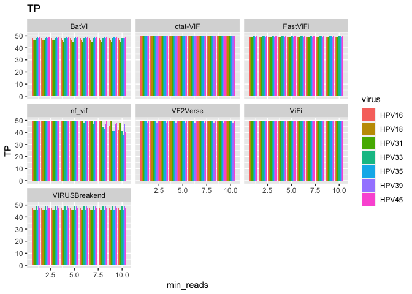<!-- -->

``` r
# TPs
data %>% ggplot(aes(x=min_reads, y=TP, fill=method)) + geom_col(position='dodge') + facet_wrap(~virus) + ggtitle("TP")
```

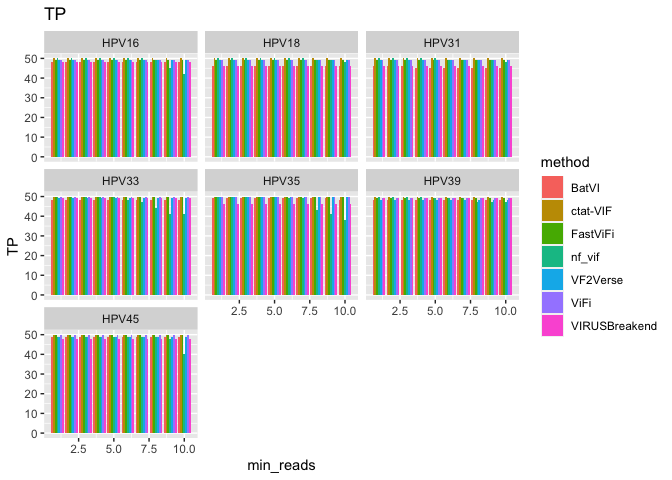<!-- -->

# Examine FPs

``` r
data %>% ggplot(aes(x=min_reads, y=FP, fill=virus)) + geom_col(position='dodge') + facet_wrap(~method) + ggtitle("FP") +
  xlim(c(2,NA)) + ylim(0,10) + theme_bw()
```

    ## Warning: Removed 986 rows containing missing values (`geom_col()`).

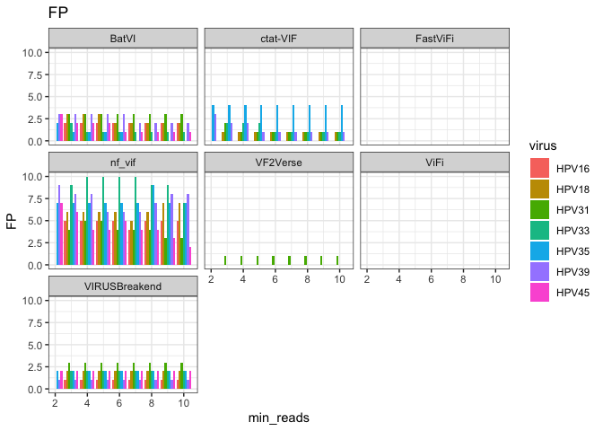<!-- -->

``` r
# TPs
data %>% ggplot(aes(x=min_reads, y=FP, fill=method)) + geom_col(position='dodge') + facet_wrap(~virus) + ggtitle("FP") + 
 xlim(c(2,NA)) + ylim(0,10) + theme_bw()
```

    ## Warning: Removed 995 rows containing missing values (`geom_col()`).

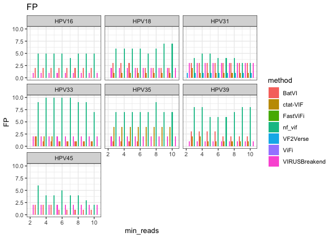<!-- -->

``` r
MIN_READS = 5

data %>% filter(min_reads == MIN_READS) %>%
  gather(key=scoreType, value=scoreVal, TP, FP) %>%
  ggplot(aes(x=method, y=scoreVal, fill=scoreType)) + geom_col() +
    theme_bw() +
  facet_wrap(~virus) + theme(axis.text.x = element_text(angle = 90, hjust = 1)) 
```

    ## Warning: Removed 88 rows containing missing values (`position_stack()`).

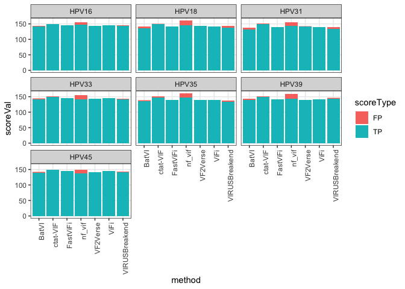<!-- -->

``` r
NUM_INSERTIONS_PER_REPLICATE = 50

data = data %>%  mutate(FP = ifelse(is.na(FP), 0, FP)) %>%
  mutate(recall = TP / NUM_INSERTIONS_PER_REPLICATE * 100) %>%
  mutate(precision = TP / (TP + FP) * 100) %>%
  mutate(F1 = (2 * precision * recall)  / (precision + recall)) 
```

``` r
data %>% filter(min_reads == MIN_READS) %>% 
  ggplot(aes(x=method, y=recall, fill=method)) + geom_col(position='dodge') + facet_wrap(~virus) + 
    theme_bw() +
  theme(axis.text.x = element_text(angle = 90, hjust = 1)) +
  ggtitle("Recall")
```

<!-- -->

``` r
data %>% filter(min_reads == MIN_READS) %>%
  ggplot(aes(x=method, y=precision, fill=method)) + geom_col(position='dodge') + facet_wrap(~virus) +
    theme_bw() + 
  theme(axis.text.x = element_text(angle = 90, hjust = 1)) +
  ggtitle("Precision")
```

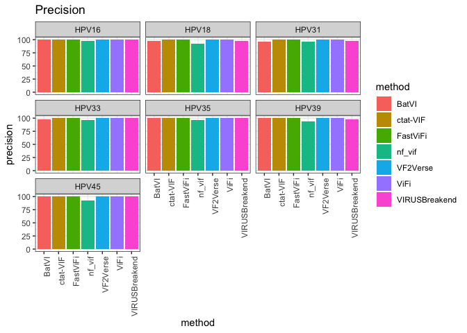<!-- -->

``` r
data %>% filter(min_reads == MIN_READS) %>%
  ggplot(aes(x=method, y=F1, fill=method)) + geom_col() + facet_wrap(~virus) + 
    theme_bw() +
  theme(axis.text.x = element_text(angle = 90, hjust = 1)) +
  ggtitle("F1")
```

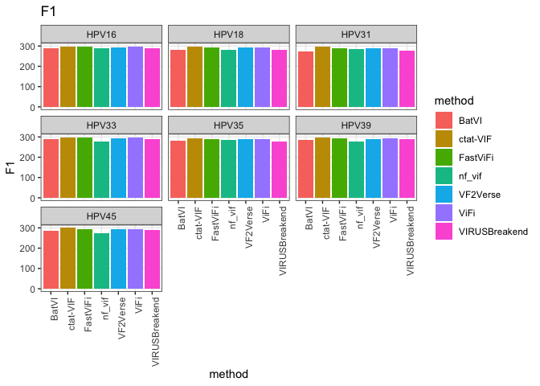<!-- -->

``` r
data %>% filter(min_reads == MIN_READS) %>%
  ggplot(aes(x=virus, y=F1, fill=method)) + geom_col(position='dodge') +
    theme_bw() +
  theme(axis.text.x = element_text(angle = 90, hjust = 1)) +
  ggtitle("F1")
```

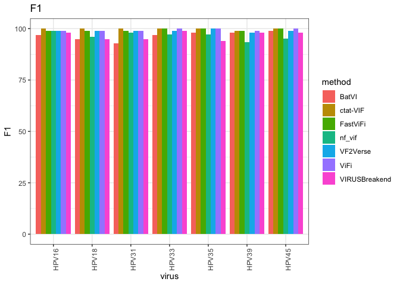<!-- -->

# summary plots

``` r
TEST_VIRUSES = c("HPV16", "HPV18", "HPV31", "HPV33", "HPV35", "HPV39", "HPV45")
```

## per virus accuracy stats

``` r
summary_accuracy_stats_by_virus = data %>% filter(min_reads == MIN_READS) %>% 
  filter(virus %in% TEST_VIRUSES) %>%
  group_by(virus, method) %>% summarize(mean_recall = mean(recall),
                                 stderr_recall = sd(recall)/sqrt(n()),
                                 mean_precision = mean(precision),
                                 stderr_precision = sd(precision)/sqrt(n()),
                                 mean_F1 = mean(F1),
                                 stderr_F1 = sd(F1)/sqrt(n()) )
```

    ## `summarise()` has grouped output by 'virus'. You can override using the
    ## `.groups` argument.

``` r
summary_accuracy_stats_by_virus %>% ggplot(aes(x=mean_recall, y=mean_precision, color=method)) + geom_point() +
    theme_bw() +
  geom_errorbar(aes(ymin=mean_precision-stderr_precision, ymax=mean_precision+stderr_precision), width=.2) +
  geom_errorbar(aes(xmin=mean_recall-stderr_recall, xmax=mean_recall+stderr_recall), width=.2) +
  facet_wrap(~virus)
```

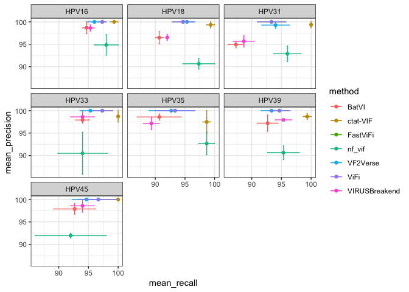<!-- -->

``` r
summary_accuracy_stats_by_virus %>% ggplot(aes(x=reorder(method, mean_F1), y=mean_F1, color=method)) + geom_point() +
    theme_bw() +
  geom_errorbar(aes(ymin=mean_F1-stderr_F1, ymax=mean_F1+stderr_F1), width=.2) +
  facet_wrap(~virus)  + theme(axis.text.x = element_text(angle = 90, hjust = 1))
```

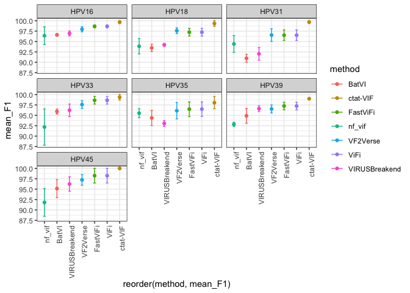<!-- -->

## overall summary accuracy stats

``` r
summary_accuracy_stats = data %>% filter(min_reads == MIN_READS) %>% 
  filter(virus %in% TEST_VIRUSES) %>%
  group_by(method) %>% summarize(mean_recall = mean(recall),
                                 stderr_recall = sd(recall)/sqrt(n()),
                                 mean_precision = mean(precision),
                                 stderr_precision = sd(precision)/sqrt(n()),
                                 mean_F1 = mean(F1),
                                 stderr_F1 = sd(F1)/sqrt(n()) )
```

``` r
summary_accuracy_stats %>% ggplot(aes(x=mean_recall, y=mean_precision, color=method)) + geom_point() +
    theme_bw() +
  geom_errorbar(aes(ymin=mean_precision-stderr_precision, ymax=mean_precision+stderr_precision), width=.2) +
  geom_errorbar(aes(xmin=mean_recall-stderr_recall, xmax=mean_recall+stderr_recall), width=.2)
```

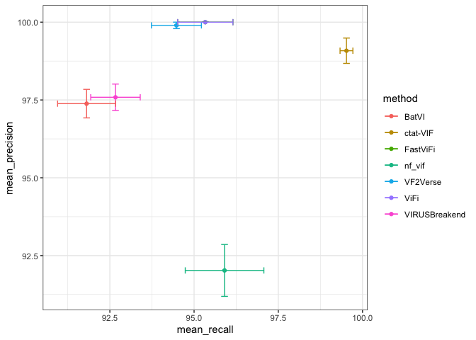<!-- -->

``` r
summary_accuracy_stats %>% ggplot(aes(x=reorder(method, mean_F1), y=mean_F1, color=method)) + geom_point() +
    theme_bw() +
  geom_errorbar(aes(ymin=mean_F1-stderr_F1, ymax=mean_F1+stderr_F1), width=.2)  + theme(axis.text.x = element_text(angle = 90, hjust = 1))
```

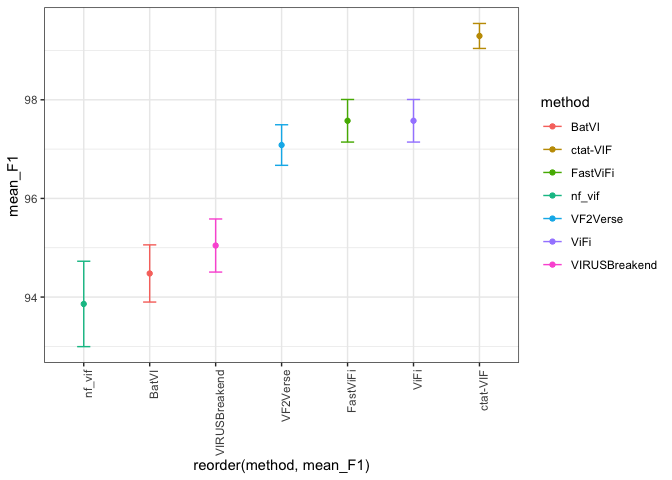<!-- -->
